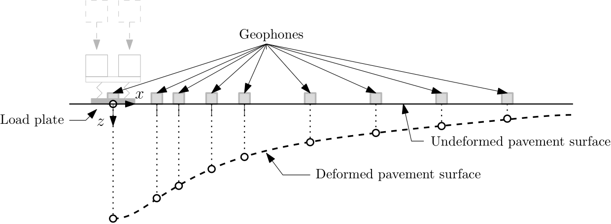
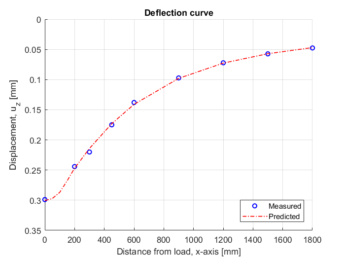
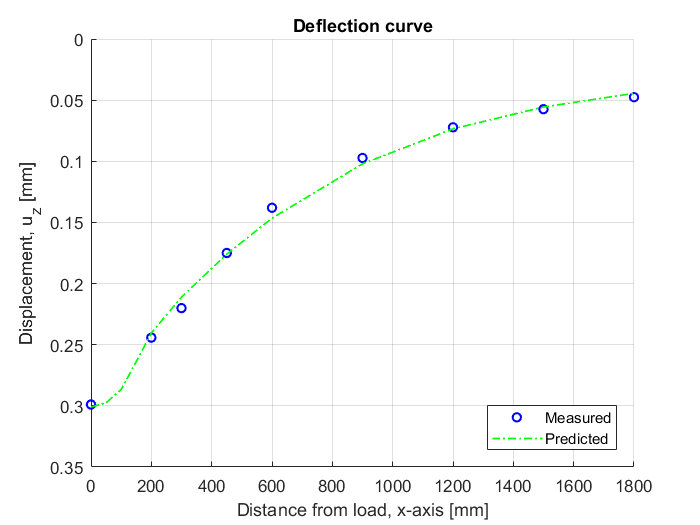

Skar, Asmus, Andersen, Sebastian and Julius Nielsen (2020): Adaptive Layered Viscoelastic Analysis (ALVA). Technical University of Denmark. Software. https://doi.org/10.11583/DTU.12387305

# ALVA
Adaptive Layered Viscoelastic Analysis (ALVA) is a MATLAB-package for pavement modeling. The aim with the software is to equip the civil engineering community with an advanced pavement modeling tool and computer package that is highly adaptive, transparent and open-access, capable of supporting current and future pavement evaluation needs. 

The components of the ALVA software (shown in the Figure) is briefly described below:
* `main.m` - main script for defining vehicle loading conditions, pavement structure geometry and material properties, numerical parameters (for balancing accuracy and efficiency), analysis type and evaluation points (i.e., location of the output response), and post-processing of the results. <b>The `main.m` scripts can be found in the ../ALVA/examples_ folder.</b>

* `init_LET.m` - initialize the analysis of a layered elastic half space selecting between: (a) `let_response_full.m` - evaluates the response (displacements, stresses and strains) of a layered elastic half-space model or (b) `let_response_polfit.m` - evaluates the displacements of a layered elastic half space model at the surface only. 

* `init_LET.m` also works as an interface application for simulating moving loads in the *Viscoelastic module*; based on the asphalt material properties from `VE_moduli.m` the module is engaged to calculate the elastic responses in `VE_response.m`, which is subsequently used to predict the linear viscoelastic response of a moving vehicle in `VE_simulation.m`.

* The main support functions in `init_LET.m` are (a) `arb_funct.m` - evaluates the coefficients of integration that embody the layered system properties and connectivity and (b) `numint_coeff.m` – organizes the integration points and weights for numerical integration for the user defined number of Bessel roots from `besselroots.m` and gauss points and weights between Bessel roots from `lookup_gauss.m`.

* Additional support functions for efficient surface displacement calculations in `let_response_polfit.m` is `arb_func_polfit.m` – interpolates intermediate coefficients of integration, `polfit_int.m` – evaluates coefficient proportional integrals, and `polfit_abc.m` – evaluates coefficients a, b and c for the polynomial.
Examples on ‘main.m’ scripts can be found in the _../ALVA/examples_ folder and all underlying components (i.e., source files) described above in the _../ALVA/basic_ folder.

## Main input parameters
The core algorithm behind this package is based on LET, i.e., the classic formulation for an <i>N</i>-layered half-space, shown in <b>Figure 1</b> 

 <b>Figure 1: </b><i>N</i>-layered half-space model 

In this model all layers are assumed linear elastic, isotropic, homogeneous, fully bonded, and weightless. The model inputs include Young’s modulus En, Poisson’s ratio <i>&Nu;n</i>, and layer thickness tn (where <i>n</i> denotes the layer number). This model is engaged to calculate the response at any point, Aj, of interest and for a given set of uniformly distributed circular loadings with load radius, <i>a</i>, and pressure <i>q</i>). An overview of LET model assumptions and solution procedure is given in [Khazanovich and Wang (2007)](https://journals.sagepub.com/doi/abs/10.3141/2037-06)

The viscoelastic response is approximated based on the LET calculations utilizing the methodology and load scheme suggested by [Levenberg (2016)](https://orbit.dtu.dk/en/publications/viscoelastic-pavement-modeling-with-a-spreadsheet) (see <b>Figure 2</b>). Viscoelastic layers are associated with a creep compliance and model parameters <i>D0</i> and <i>D&infin;</i>, the short and long time compliances (respectively), and shape parameters <i>&tau;D</i> and <i>nD</i>, controlling the transition between <i>D0</i> and <i>D&infin;</i>. 

<b>Figure 2: </b>Load scheme to simulate movement

The load moves in a straight line from <i>x=-x0</i> (Start) to <i>x=x0</i> (End). The travel path is decomposed into <i>N</i> intervals (<i>i=1,…,N</i>), each <i>&Delta;x</i> long. The point of response evaluation <i>Aj</i> is indicated in the Figure; this point is located near the middle of the travel path (i.e., <i>x</i>-coordinate of zero), at <i>y</i>-coordinate <i>y0</i> and depth <i>z0</i> below the surface. 

## Code validation 
ALVA comes with six validation cases/examples (i.e., `main.m` scripts), comparing ALVA to existing pavement analysis sofware and analytical formulations. 
The files can be found in the in the _../ALVA/examples_ folder and the results obtained with independent codes can be found in the found in the _../ALVA/validation_ folder.  

### Case 1 - Basic validation at critical points in the pavemenet system (benchmark results)
In this section a basic validation of the ALVA package is presented, comparing ALVA repsonses to the [Advanced Models for Analytical Design of European Pavement Structures (AMADEUS, 2000)](https://trimis.ec.europa.eu/project/advanced-models-analytical-design-european-pavement-structures) report for benchmarking. As part of the AMADEUS study a number of popular response models were compared against the standard pavement structure shown in <b>Table 1</b>. Three packages, [BISAR](https://trid.trb.org/view/683379), [KENLAYER](https://www.webpages.uidaho.edu/ce475/files/software%20files/software.htm) and [GAMES](http://www.jsce.or.jp/committee/pavement/downloads/), that can facilitate layer interface slip situations, were further compared against ALVA for the proposed reference pavement system.

'ALVA_bonding_validation1.m' - tests the implementation of the interface spring model, as well as compares the ALVA model with a range of commonly used software at critical positions within the pavament system published by the [European Commission](https://trimis.ec.europa.eu/project/advanced-models-analytical-design-european-pavement-structures).

| Layer    | Thickness (mm) | Youngs moduli (MPa) | Poisson's ratio  |    
|----------|----------------|---------------------|------------------|
| 1        |   260          |     5000            |   0.35           |
| 2        |   500          |      200            |   0.40           |
| 3        |   &infin;      |       50            |   0.45           |

<b>Table 1</b>: Reference pavement system used in basic validation of the code.

| Load     | Radius (mm)    | Pressure, q (MPa) | x-position (mm) |  y-position (mm) |    
|----------|----------------|-------------------|-----------------|------------------|
| Single   |   150.8        |     0.7           |      0          |   0              |
| Dual (1) |   106.6        |     0.7           |   -170          |   0              |
| Dual (2) |   106.6        |     0.7           |    170          |   0              |

<b>Table 2</b>: Load cases used for basic validation of the code. 

| Name        | Response                                   | Location                   | Unit   |
|-------------|--------------------------------------------|----------------------------|--------|
| R1          | Vertical stress at surface                 | Load center                | MPa    |
| R2          | Horizontal strain at the bottom of layer 1 | ''                         | micron |
| R3          | Vertical strain at the top of layer 2      | ''                           | micron |
| R4          | Vertical strain at the top of layer 3      | ''                           | micron |
|-------------|--------------------------------------------|----------------------------|--------|
| R5          | Vertical stress at surface                 | Edge of load               | MPa    |
| R6          | Horizontal strain at the bottom of layer 1 | ''                           | micron |
| R7          | Vertical strain at the top of layer 2      | ''                           | micron |
| R8          | Vertical strain at the top of layer 3      | ''                           | micron |

<b>Table 2</b>: Description of key-point responses used for basic validation of the code. 

| Software    |   R1    |     R2   |    R3   |    R4   |  R5   |     R6   |  R7     |    R8  |
|-------------|---------|----------|---------|---------|-------|----------|---------|--------|
| BISAR       |   0.7   |  -100.5  |  251.7  |    185  |  0.4  |   -61.9  |  192.2  |  177.5 |
| KENLAYER    |   0.8   |  -100.5  |  251.6  |  185.3  |  0.3  |     -62  |  192.2  |    177 |
| GAMES       |   0.7   |  -100.5  |  251.6  |  185.1  |  0.3  |   -61.9  |  192.2  |  177.5 |
| ALVA ('Slip') |   0.7   |  -100.4  |  251.6  |  185.1  |  0.3  |   -61.8  |  192.3  |  177.5 |
| ALVA ('Bonded') |   0.7   |  -100.4  |  251.6  |  185.1  |  0.3  |   -61.8  |  192.3  |  177.5 |

<b>Table 3</b>: Reference pavement system subjeceted to a single wheel load - bonded interfaces.

| Software    |   R1    |     R2   |    R3   |    R4   |  R5   |     R6   |  R7     |    R8  |
|-------------|---------|----------|---------|---------|-------|----------|---------|--------|
| BISAR       |   0.7   |    -120  |    1    |   217   | 0.4    |   -78   |  -10    |  205 |
| KENLAYER    |   0.7   |    -120  |    1    |   216   |   0    |   -78   |  -10    |  205 |
| GAMES       |   0.7   |    -119  |   11    |   217   |   0    |   -77   |   -1    |  205 |
| ALVA ('Slip') |   0.7   |  -119.5  |  0.7    | 216.5   | 0.3    | -77.8   | -9.7    |204.7 |

<b>Table 4</b>: Reference pavement system subjeceted to a single wheel load - unbonded interface between layer 1 and 2, bonded interface between layer 2 and 3.

| Software    |   R1    |     R2   |    R3   |    R4   |  R5   |     R6   |  R7     |    R8  |
|-------------|---------|----------|---------|---------|-------|----------|---------|--------|
| BISAR       |   0.7   |    N/A   | 186     |  170    |0      |   N/A    |  182    |  177   |
| KENLAYER    |   1.5   |    -85   | 186     |  170    |0      |   -89    |  183    |  177   |
| GAMES       |   0.7   |    -85   | 186     |  170    |0      |   -89    |  183    |  177   |
| ALVA ('Slip') |   0.7   |  -84.9   | 186     | 169.7   | 0     |  -88.8   | 183.2   | 177.2  |
| ALVA ('Bonded') |   0.7   |  -84.9   | 186     | 169.7   | 0     |  -88.8   | 183.2   | 177.2  |

<b>Table 5</b>: Reference pavement system subjeceted to a dual wheel load - bonded interfaces.

| Software    |   R1    |     R2   |    R3   |    R4   |  R5   |     R6   |  R7     |    R8  |
|-------------|---------|----------|---------|---------|-------|----------|---------|--------|
| BISAR       |   0.7   |     N/A  |     9   |   193   | 0     |   N/A    |  -12    |   204  |
| KENLAYER    |   0.7   |    -120  |    -1   |   216   | 0     |   -78    |  -10    |   205  |
| GAMES       |   0.7   |    -101  |    -3   |   194   | 0     |  -106    |    1    |   205  |
| ALVA ('Slip') |   0.7   |  -102.6  |  -9.2   | 193.4   | 0     |  -107    |-11.5    | 204.1  |

<b>Table 6</b>: Reference pavement system subjeceted to a dual wheel load - unbonded interface between layer 1 and 2, bonded interface between layer 2 and 3.

### Case 2 - Vertical stresses and displacements for an elastic half-space with depth
Another basic validation step is carried by comparing vertical stresses and displacements in the line of loading with depth to the classical Boussinesq solution.

`ALVA_let_validation1.m` - tests the implementation of the ALVA LET model calculating vertical stresses and displacements with depth for a half-space subjected to a single circular load. The results are compared to the analytical Boussinesq solution and the computer programme [ELLEA1](https://orbit.dtu.dk/en/publications/ellea1-isotropic-layered-elasticity-in-excel-pavement-analysis-to). 

<i>Note</i>: Minimum two layers is required for analysis of pavement systems in ALVA. For analysis of one-layer / half-space systems - select identical parameters for each layer, as well as <i>"bonded"</i> interface conditions 

<b>Figure 3</b>: Validation: Half-space model.

### Case 3 - Vertical and horizontal stresses and displacements with depth

`ALVA_let_validation2.m` - tests the implementation of the ALVA LET model, calculating stresses and displacements with depth for a multilayered pavement subjected to two circular loads utilizing the method proposed. The results are compared to the computer programme [ELLEA1]( https://orbit.dtu.dk/en/publications/ellea1-isotropic-layered-elasticity-in-excel-pavement-analysis-to).

<b>Figure 4</b>: Validation: Multilayered model subjected to dual wheel load.

### Case 4 - Surface displacements
In situ evaluation of mechanical pavement properties requires fitting measured surface displacements with model displacements. Such inverse analysis is guided by optimisation algorithms that entail re-execution of the underlying model many times over. For layered elasticity, which is the most commonly employed pavement model, this involves calculating computationally demanding semi-infinite integrals in every optimisation step. In this connection, a method was proposed (and implemented into ALVA) to improve the computational efficiency of surface displacement re-calculations in layered elastic systems.

`ALVA_let_validation3.m` - tests the implementation of the acclerated ALVA LET model, calculating the surface displacements with length for a multilayered pavement subjected to two circular loads utilizing the method proposed in [Andersen et al. (2020)]( https://orbit.dtu.dk/en/publications/efficient-reevaluation-of-surface-displacements-in-a-layered-elas). The results are compared to the computer programme [ELLEA1]( https://orbit.dtu.dk/en/publications/ellea1-isotropic-layered-elasticity-in-excel-pavement-analysis-to).

<b>Figure 5</b>: Validation: Acceleration method for efficient calculation of surface displacements.

### Case 5 - Shear stresses
`ALVA_let_validation4.m` - tests the implementation of the ALVA LET model calculating shear stresses with depth for a half-space subjected to a single circular load. The results are compared to the computer programme [ELLEA1]( https://orbit.dtu.dk/en/publications/ellea1-isotropic-layered-elasticity-in-excel-pavement-analysis-to).

<b>Figure 5</b>: Validation: Shear stresses multilayered model subjected to single wheel load.

### Case 6 - Shear strains
`ALVA_let_validation5.m` - tests the implementation of the ALVA LET model calculating shear strain with depth for a multilayered pavement subjected to two circular loads. The results are compared to the computer programme [ELLEA1]( https://orbit.dtu.dk/en/publications/ellea1-isotropic-layered-elasticity-in-excel-pavement-analysis-to).

<b>Figure 6</b>: Validation: Strains in multilayered model subjected to a dual wheel load.

### Case 7 - Viscoelastic model (time dependent material behaviour)
* `ALVA_visco_validation1.m` - tests the implementation of the ALVA VE model, calculating the displacements for a single evaluation point on the surface of a multilayered pavement considering a single circular load. The results are compared to the computer programme [ELLVA1]( https://orbit.dtu.dk/en/publications/ellva1-isotropic-layered-viscoelasticity-in-excel-moving-load-adv), see details in [Levenberg (2016)]( https://orbit.dtu.dk/en/publications/viscoelastic-pavement-modeling-with-a-spreadsheet).

## User examples
In this section we present relevant user examples with ALVA. 

### Example 1 - Backcalculation of layer moduli
`ALVA_let_backcalculation.m` - tests the implementation of the ALVA LET model for inferring layer moduli, or so called "backcalculation" of layer moduli, based on Falling Weight Deflectometer (FWD) measurements. The measurements was carried at DTU Lyngby Campus, Denmark Summer 2019. 

The support script `inv_loop.m` was developed for this specific example. Moreover, for this optimisation problem, the 'fminsearch.m' function in MATLAB was utilized, i.e., the [Nelder–Mead simplex (NMS)](https://academic.oup.com/comjnl/article-abstract/7/4/308/354237) multidimensional optimisation algorithm. 

#### Input 

<b>Figure 8</b>: Principle of operation for the Falling Weight Deflectometer (FWD) test: load and measurement configuration

| Layer    | Thickness (mm) | Youngs moduli (MPa) | Poisson's ratio  |    
|----------|----------------|---------------------|------------------|
| 1        |   161          |      ?              |   0.35           |
| 2        |   260          |      ?              |   0.35            |
| 3        |   &infin;      |      ?              |   0.35            |

<b>Table 7</b>: Measured pavement ticknesses. 

| Load     | Radius (mm)    | Pressure, q (MPa) | x-position (mm) |  y-position (mm) |    
|----------|----------------|-------------------|-----------------|------------------|
| Single   |   150          |     0.7           |      0          |   0              |

<b>Table 8</b>: Falling Weight Deflectometer (FWD) load. 

| Geophone                          |   G1    |     G2   |    G3    |    G4    |   G5    |     G6   |    G7     |    G8   | G9     |
|-----------------------------------|---------|----------|----------|----------|---------|----------|-----------|---------|--------|
| Location along x-axis (mm):       |   0     |    200   |    300   |    450   |  600    |    900   |  1200     |   1500  |  1800  |
| Displacement measurement (&mu;m): | 298.9   |    244.2 |    220.07|    175.0 | 138.0   |   97.3   |   72.2    |     57.4|    47.6|

<b>Table 9</b>: Sensor location and displacement measurements.

ALVA 'Bonded'              |  ALVA 'Frictionless'
:-------------------------:|:-------------------------:
  |  

<b>Figure 9</b>: Predicted versus measured pavement displacements.

| Layer    | Thickness (mm) | Young's moduli (MPa) - 'Bonded' | Young's moduli (MPa) - 'Frictionless' | Poisson's ratio   |    
|----------|----------------|---------------------------------|---------------------------------------|-------------------|
| 1        |   161          |    4885                         |  2828                                 |   0.35            |
| 2        |   260          |     314                         |  2392                                 |   0.35            |
| 3        |   &infin;      |     179                         |  162                                  |   0.35            |

<b>Table 10</b>: Backcalculated Young's moduli. 

## Installation
* Download the package on your PC. 
* Open MATLAB
* Go to the directory 'ALVA'
* add the different directories of the ALVA on your MATLAB path — Now you are ready to run the validation examples provided and generate your own analysis. 
* ALAVA is compatible with [OCTAVE](https://www.gnu.org/software/octave/index)
