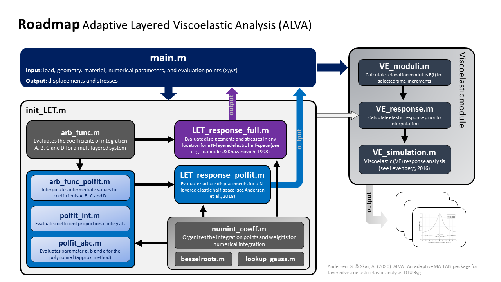
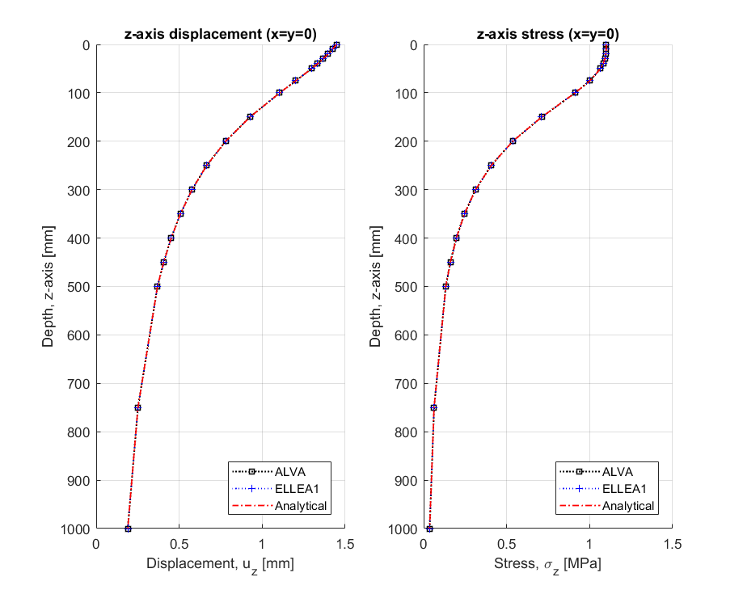
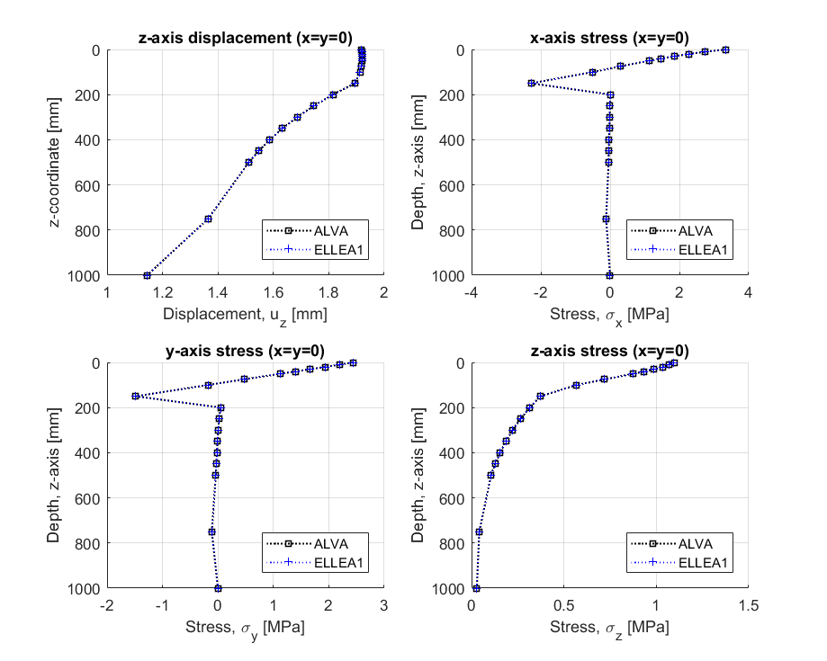
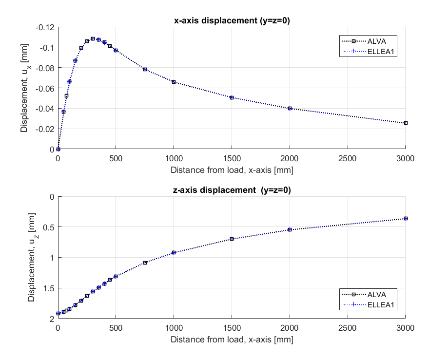
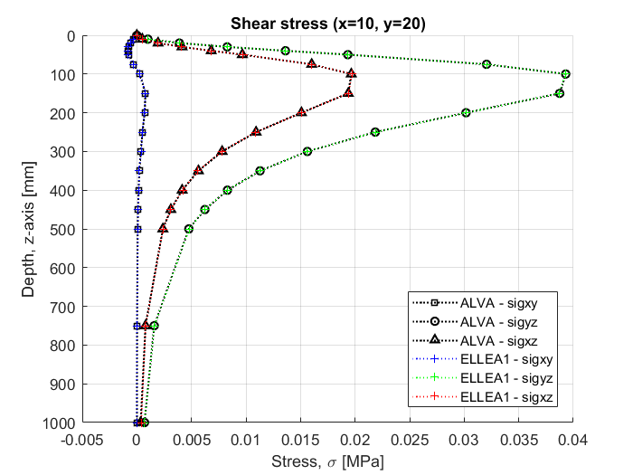
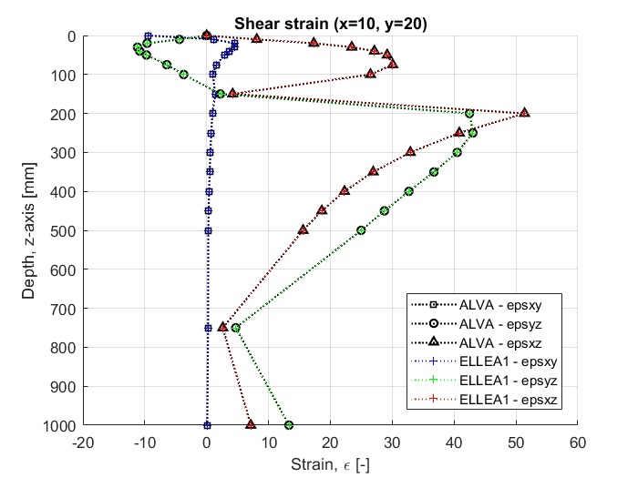
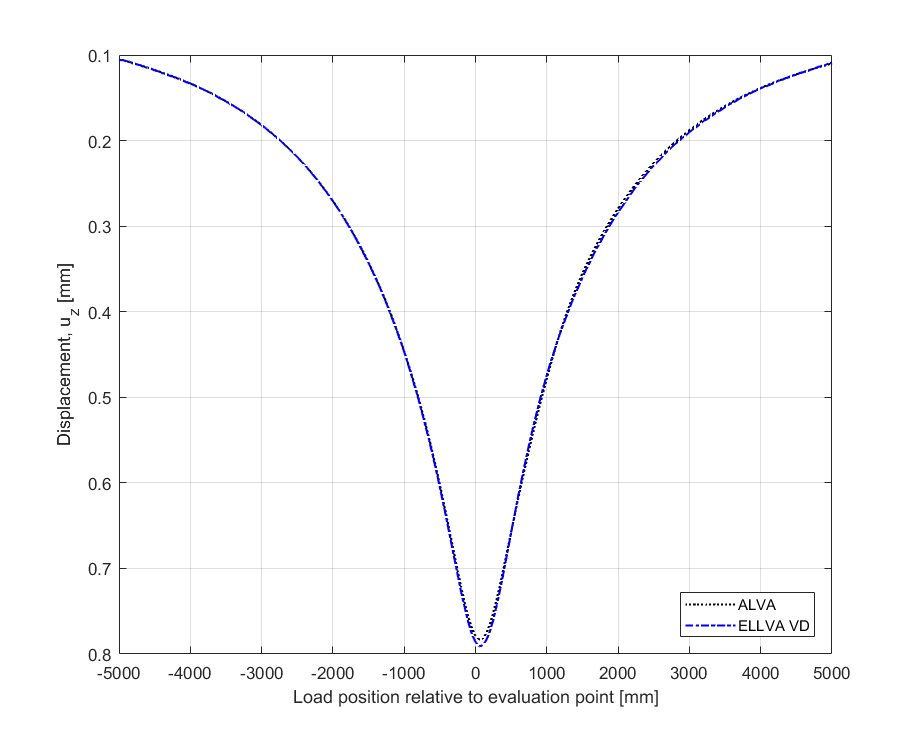

Skar, Asmus, Andersen, Sebastian and Julius Nielsen (2020): Adaptive Layered Viscoelastic Analysis (ALVA). Technical University of Denmark. Software. https://doi.org/10.11583/DTU.12387305

# ALVA
Adaptive Layered Viscoelastic Analysis (ALVA) is a MATLAB-package for pavement modeling. The aim with the software is to equip the civil engineering community with an advanced pavement modeling tool and computer package that is highly adaptive, transparent and open-access, capable of supporting current and future pavement evaluation needs. 

The components of the ALVA software (shown in the Figure) is briefly described below:
* `main.m` - main script for defining vehicle loading conditions, pavement structure geometry and material properties, numerical parameters (for balancing accuracy and efficiency), analysis type and evaluation points (i.e., location of the output response), and post-processing of the results.
* `init_LET.m` - initialize the analysis of a layered elastic half space selecting between: (a) `let_response_full.m` - evaluates the response (displacements, stresses and strains) of a layered elastic half-space model or (b) `let_response_polfit.m` - evaluates the displacements of a layered elastic half space model at the surface only. 
* `init_LET.m` also works as an interface application for simulating moving loads in the *Viscoelastic module*; based on the asphalt material properties from `VE_moduli.m` the module is engaged to calculate the elastic responses in `VE_response.m`, which is subsequently used to predict the linear viscoelastic response of a moving vehicle in `VE_simulation.m`.
* The main support functions in `init_LET.m` are (a) `arb_funct.m` - evaluates the coefficients of integration that embody the layered system properties and connectivity and (b) `numint_coeff.m` – organizes the integration points and weights for numerical integration for the user defined number of Bessel roots from `besselroots.m` and gauss points and weights between Bessel roots from `lookup_gauss.m`.

* Additional support functions for efficient surface displacement calculations in `let_response_polfit.m` is `arb_func_polfit.m` – interpolates intermediate coefficients of integration, `polfit_int.m` – evaluates coefficient proportional integrals, and `polfit_abc.m` – evaluates coefficients a, b and c for the polynomial.
Examples on ‘main.m’ scripts can be found in the _../ALVA/examples_ folder and all underlying components (i.e., source files) described above in the _../ALVA/basic_ folder.

## Main input parameters
The core algorithm behind this package is based on LET, i.e., the classic formulation for an N-layered half-space, shown below.

In this model all layers are assumed linear elastic, isotropic, homogeneous, fully bonded, and weightless. The model inputs include Young’s modulus En, Poisson’s ratio &Nun, and layer thickness tn (where n denotes the layer number). This model is engaged to calculate the response at any point, Aj, of interest and for a given set of uniformly distributed circular loadings with load radius, a, and pressure q). An overview of LET model assumptions and solution procedure is given in [Khazanovich and Wang (2007)](https://journals.sagepub.com/doi/abs/10.3141/2037-06)

The viscoelastic response is approximated based on the LET calculations utilizing the methodology and load scheme suggested by [Levenberg (2016)](https://orbit.dtu.dk/en/publications/viscoelastic-pavement-modeling-with-a-spreadsheet). Viscoelastic layers are associated with a creep compliance and model parameters D0 and D&infin;, the short and long time compliances (respectively), and shape parameters &tau;<sub\D and n<sub\D;, controlling the transition between D0 and D&infin;. 

The load moves in a straight line from x=-x0 (Start) to x=x0 (End). The travel path is decomposed into N intervals (i=1,…,N), each &Delta;x long. The point of response evaluation is indicated in the Figure; this point is located near the middle of the travel path (i.e., x-coordinate of zero), at y-coordinate y0 and depth z0 below the surface. 

## Validation examples
ALVA comes with five validation examples (i.e., `main.m` scripts) comparing ALVA to existing codes and analytical formulations. 
The example files can be found in the in the _../ALVA/examples_ folder and the results obtained with independent codes can be found in the found in the _../ALVA/validation_ folder.  
The following examples are included in this package:

* `ALVA_let_validation1.m` - tests the implementation of the ALVA LET model calculating  vertical stresses and displacements with depth for a half-space subjected to a single circular load. The results are compared to the analytical Boussinesq solution and the computer programme [ELLEA1](https://orbit.dtu.dk/en/publications/ellea1-isotropic-layered-elasticity-in-excel-pavement-analysis-to). 

* `ALVA_let_validation2.m` - tests the implementation of the ALVA LET model, calculating stresses and displacements with depth for a multilayered pavement subjected to two circular loads utilizing the method proposed. The results are compared to the computer programme [ELLEA1]( https://orbit.dtu.dk/en/publications/ellea1-isotropic-layered-elasticity-in-excel-pavement-analysis-to).

* `ALVA_let_validation3.m` - tests the implementation of the acclerated ALVA LET model, calculating the surface displacements with length for a multilayered pavement subjected to two circular loads utilizing the method proposed in [Andersen et al. (2020)]( https://orbit.dtu.dk/en/publications/efficient-reevaluation-of-surface-displacements-in-a-layered-elas). The results are compared to the computer programme [ELLEA1]( https://orbit.dtu.dk/en/publications/ellea1-isotropic-layered-elasticity-in-excel-pavement-analysis-to).

* `ALVA_let_validation4.m` - tests the implementation of the ALVA LET model calculating shear stresses with depth for a half-space subjected to a single circular load. The results are compared to the computer programme [ELLEA1]( https://orbit.dtu.dk/en/publications/ellea1-isotropic-layered-elasticity-in-excel-pavement-analysis-to).

* `ALVA_let_validation5.m` - tests the implementation of the ALVA LET model calculating shear strain with depth for a multilayered pavement subjected to two circular loads. The results are compared to the computer programme [ELLEA1]( https://orbit.dtu.dk/en/publications/ellea1-isotropic-layered-elasticity-in-excel-pavement-analysis-to).

* `ALVA_visco_validation1.m` - tests the implementation of the ALVA VE model, calculating the displacements for a single evaluation point on the surface of a multilayered pavement considering a single circular load. The results are compared to the computer programme [ELLVA1]( https://orbit.dtu.dk/en/publications/ellva1-isotropic-layered-viscoelasticity-in-excel-moving-load-adv), see details in [Levenberg (2016)]( https://orbit.dtu.dk/en/publications/viscoelastic-pavement-modeling-with-a-spreadsheet).

## Installation
* Download the package on your PC. 
* Open MATLAB
* Go to the directory 'ALVA'
* add the different directories of the ALVA on your MATLAB path — Now you are ready to run the validation examples provided and generate your own analysis. 
