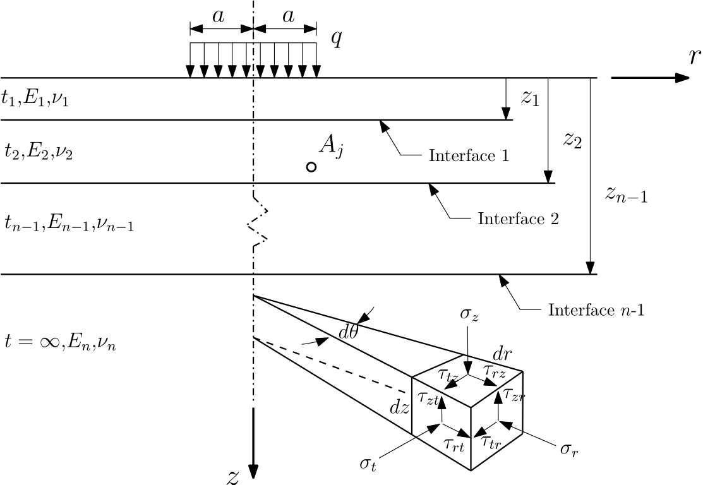

# Summary
A key component in design and analysis of asphalt pavements is the response model, used to calculate the stresses, strains and displacements in the structure, when subjected to mechanical loading. For many years, response models formulated within the theoretical continuum-mechanics framework of a stratified half-space have been successfully used [@khazanovich:2007a]. In this framework a pavement system is viewed as a collection of layers, each of finite thickness, resting on a semi-infinite medium, also referred to as the Layered Elastic Theory (LET) [@Burmister:1945a].  Several computer programs for the analysis of pavement systems were developed on the basis of LET. However, new design guidelines and in-situ evaluation of mechanical pavement properties entail re-execution of the underlying model many times over, making the response analysis extremely time consuming. This has resulted in development of numerical acceleration techniques for improved computational efficiency [@Erlingsson:2013a;@khazanovich:2007a] implemented in the computer package ELLEA [@Levenberg:2016a]. Moreover, the engineering community is placing increased emphasis on linear viscoelastic characterization of asphalt materials. It is therefore anticipated, that routine pavement-related calculations would soon evolve to include time dependent layer properties and moving loads as supported by the computer packages ViscoRoute [@Chabot:2010a] and ELLVA [@Levenberg:2016b]. Other relevant features for pavement evaluation, incorporated with the computer package GAMES, is the capability of describing both vertical and shear loadings, as well as perfect and deficient bonding along the interfaces of neighboring layers [@Maina:2004a].

Although, pavement analysis tools have been developed to address the limitations of conventional LET analysis, there are currently no computer package that supports all aforementioned needs in a unified manner. Moreover, existing software are often limited to standard design problems (e.g., only applicable to a limited number of layers and loads) and the control over the program features is restricted (e.g., source codes not available, implementation not documented, numerical parameters fixed). This paper presents a software, named Adaptive Layered Viscoelastic Analysis (ALVA), with the aim  to equip the civil engineering community with an advanced pavement modeling tool and computer package that is highly adaptive, transparent and open-access, capable of supporting current and future pavement evaluation needs. 

To achieve this, some of the most promising numerical techniques that are currently available for effectively solving elastic and linear viscoelastic layered problems is implemented in a MATLAB computer package. The core algorithm behind this package is based on LET, i.e., the classic formulation for an $N$-layered half-space [@Burmister:1945a], shown in Figure \ref{fig:model}.

{width=75%}

In this model all layers are assumed linear elastic, isotropic, homogeneous, and weightless. The model inputs include Young’s modulus $E_{n}$, Poisson’s ratio $\nu_{n}$, and layer thickness $t_{n}$ (where $n$ denotes the layer number). This model is engaged to calculate the response (i.e., stresses and strains) at any point, $A_{j}$, of interest and for a given set of uniformly distributed circular loadings with load radius, $a$, and pressure $q$). In addition ALVA allows users to define horizontally oriented springs operating at the top or bottom layer interfaces to model imperfect interface conditions [@Levenberg:2020a]. Moreover, numerical features for improved code performance are implemented, e.g., acceleration techniques to speed computational time for analysis of surface displacements [@Andersen:2020a] and full response analysis [@khazanovich:2007a; @Levenberg:2016a], as well as extrapolation technique to improve convergence [@Erlingsson:2013a]. An overview of LET model assumptions and solution procedure is given in [@khazanovich:2007a].

The viscoelastic response is approximated based on the LET calculations utilizing the methodology and load scheme suggested by [@Levenberg:2016c] (see Figure \ref{fig:load}). Viscoelastic layers are associated with the short and long time compliances $D_{0}$ and $D_{\infty}$, and shape parameters $\tau_{D}$ and $n_{D}$, controlling the transition between $D_{0}$ and $D_{\infty}$. 

{width=95%}

The load moves in a straight line from $x$=-$x_{0}$ (Start) to $x$=$x_{0}$ (End). The travel path is decomposed into $N$ intervals ($i$=1,…,$N$), each of length $\Delta x$. The point of response evaluation $A_{j}$ is indicated in Figure \ref{fig:load}; this point is located near the middle of the travel path (i.e., $x$-coordinate of zero), at $y$-coordinate $y_{0}$ and depth $z_{0}$ below the surface. 

The computer package ALVA offers a solution for the history of response inside the system at any point of interest resulting from a moving load. The code has been validated by comparing ALVA responses at several positions within pavement system to analytical solutions and other commonly used software packages, i.e.: $(i)$ for a one-layer model with the analytical solution for an elastic half-space, $(ii)$ for elastic multilayered systems with the software package ELLEA [@Levenberg:2016a], and $(iii)$ for viscoelastic multilayered systems with the software package ELLVA [@Levenberg:2016b]. Moreover, the code has been validated against benchmark results, covering a range of commonly used software packages, published by the European Commission [@amadeus:2000a]. The generic computational scheme proposed enables users to control any feature of the program, including geometrical and material properties, layer interface bonding, loading conditions and numerical parameters. Thus, ALVA supports advanced analysis, e.g., detailed analysis of surface tire interaction and unconventional axle loads, and enables users to balance numerical efficiency and accuracy. ALVA can be used as is [@Andersen:2020a;@Skar:2020a] or serve as computational kernel in new software; supporting future advances in pavement analysis software and development of model-guided data interpretation schemes.

Future developments in this package may include mathematical formulations to describe more complex phenomena, e.g., $(i)$ fragmented layer conditions (multi-cracked layers); $(ii)$ both isotropic or transversely isotropic properties; $(iii)$ both vertical and horizontal surface loads. 

# References
